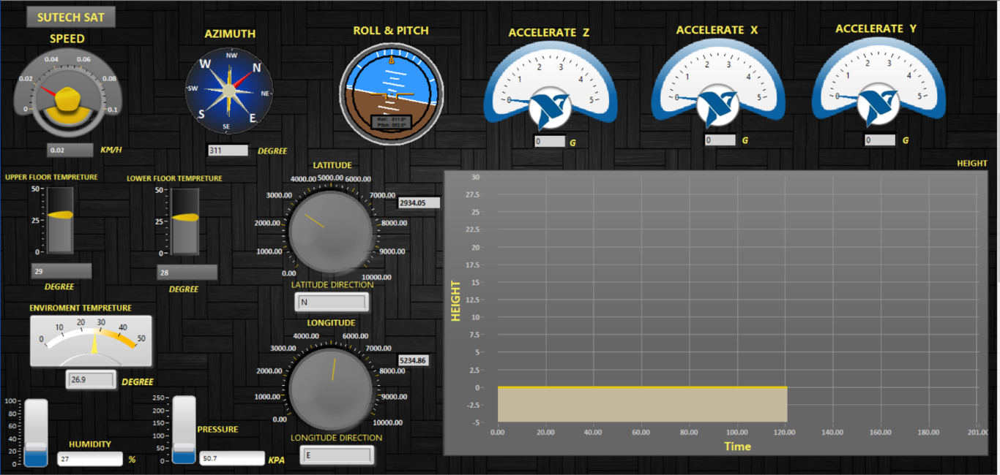
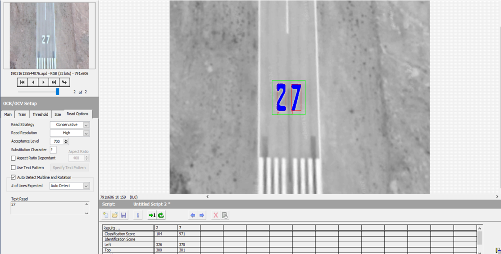

# Data-Receiver-LABVIEW

One factor that helps us verify the accuracy of transmitted information and allows us to assess the proper functionality of the set is displaying the transmitted data. The data received from the serial converter is processed through an algorithm and imported into LabVIEW software, where, if further processing is needed, it is conducted; otherwise, we proceed to display the transmitted information. Another method of receiving information, as mentioned, is by setting up a web server on a laptop. The image data sent is then processed to enhance the image, and upon display, the monitoring operation is completed.

**LABVIEW Monitoring System**
-----

**LABVIEW Image Processing System**
------

